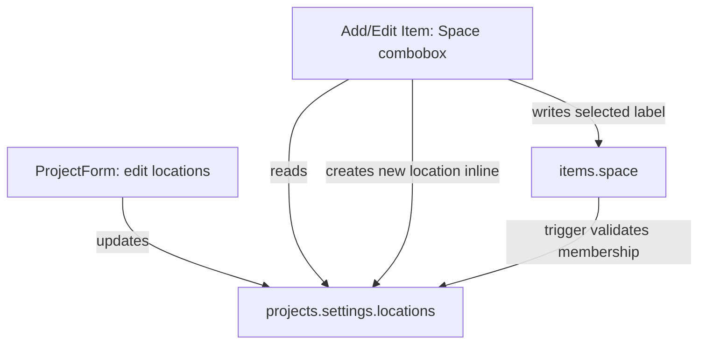

## Goal and non-goals

- **Goal**: For project items (`items.project_id` set), replace the free-text `space` input with a dropdown whose options come from **project-level location presets** that are managed in the **Create/Edit Project** modal.
- **Goal**: Allow a user to **create a new location inline** from the item screen (type it, click “Add …”), which saves it to the project’s preset list and immediately selects it.
- **Non-goal (for this change)**: Change business inventory location (`items.business_inventory_location`). Leave it as-is.

## Current state (what exists today)

- **DB**: `items.space` is a nullable text column used for project items. See `items` table in [`/Users/benjaminmackenzie/Dev/ledger/supabase/migrations/001_initial_schema.sql`](/Users/benjaminmackenzie/Dev/ledger/supabase/migrations/001_initial_schema.sql) (line ~84).
- **UI**:
  - Add item: free text Space input in [`/Users/benjaminmackenzie/Dev/ledger/src/pages/AddItem.tsx`](/Users/benjaminmackenzie/Dev/ledger/src/pages/AddItem.tsx) (around lines 837–858).
  - Edit item: free text Space input in [`/Users/benjaminmackenzie/Dev/ledger/src/pages/EditItem.tsx`](/Users/benjaminmackenzie/Dev/ledger/src/pages/EditItem.tsx) (around lines 1001–1022).
  - Bulk location change: free text modal in [`/Users/benjaminmackenzie/Dev/ledger/src/components/ui/BulkItemControls.tsx`](/Users/benjaminmackenzie/Dev/ledger/src/components/ui/BulkItemControls.tsx) (around lines 318–362).
- **Project editing**: Create/Edit project happens in [`/Users/benjaminmackenzie/Dev/ledger/src/components/ProjectForm.tsx`](/Users/benjaminmackenzie/Dev/ledger/src/components/ProjectForm.tsx).
- **Offline**: Projects and items are cached/queued via `offlineProjectService` and `offlineItemService`, and `projects.settings` is already persisted + synced in both online and offline paths (see [`/Users/benjaminmackenzie/Dev/ledger/src/services/inventoryService.ts`](/Users/benjaminmackenzie/Dev/ledger/src/services/inventoryService.ts) `projectService.updateProject`).

## Design choice (guardrails)

### Persist presets in `projects.settings.locations` (JSONB)

Use the existing `projects.settings` JSONB field rather than creating a new table.

- **Why**:
  - Fits existing project settings storage pattern.
  - Automatically covered by existing project CRUD, realtime, and offline sync.
  - Keeps junior-dev changes localized to project update flows (no new sync subsystem).
- **Schema**:
  - Store locations as a **string array**: `projects.settings.locations = ["Living Room", "Kitchen", ...]`.

### Item still stores string `items.space`

Keep `items.space` as a string (no new FK column) to avoid a large refactor.

- **Guardrail**: Add a **DB trigger** to ensure that when `project_id` is set, any non-empty `space` must be present in the project’s preset list.
- This prevents rogue writes (bulk tools, future code paths) from reintroducing inconsistent spelling.

## Data flow (high-level)

## Implementation plan

### 1) Define the canonical “locations” shape + helpers (frontend)

**Files**:

- [`/Users/benjaminmackenzie/Dev/ledger/src/types/index.ts`](/Users/benjaminmackenzie/Dev/ledger/src/types/index.ts)
- New helper module (recommended): `src/utils/locationPresets.ts`

**Steps**:

- Update `ProjectSettings` to make fields optional (it’s currently typed as required booleans but DB default is `{}`):
  - Add `locations?: string[]`.
  - Make existing booleans optional to match reality.
- Add a small shared helper:
  - `normalizeLocationName(input: string): string`:
    - `trim()`
    - collapse multiple spaces to one
    - do **not** auto-titlecase (avoid surprising users)
  - `dedupeLocations(locations: string[]): string[]`:
    - case-insensitive uniqueness on normalized name
    - preserve first-seen display casing

**Guardrails**:

- Never store empty strings.
- Always normalize before comparing.
- Always treat `project.settings` as optional/untrusted.

### 2) Add a Locations editor to Create/Edit Project modal

**File**: [`/Users/benjaminmackenzie/Dev/ledger/src/components/ProjectForm.tsx`](/Users/benjaminmackenzie/Dev/ledger/src/components/ProjectForm.tsx)

**UX spec**:

- New section near other project settings (below Description is fine):
  - Header: “Locations”
  - Inline add input + “Add” button
  - List of current locations (chips or simple list) with remove (X) per entry
  - Optional: reorder not required

**Save behavior**:

- Locations are persisted in `projects.settings.locations`.
- When creating a project: initialize `settings.locations` to `[]` unless the user adds any.
- When editing: hydrate from `initialData.settings?.locations`.

**Guardrails**:

- Do not overwrite unrelated `settings` keys. Merge:
  - `nextSettings = { ...(existingSettings ?? {}), locations: nextLocations }`.
- Validate on submit:
  - no duplicates (case-insensitive)
  - show a clear error message if user tries to add a duplicate

### 3) Add a project-level “append location” helper (service layer)

**Files**:

- [`/Users/benjaminmackenzie/Dev/ledger/src/services/inventoryService.ts`](/Users/benjaminmackenzie/Dev/ledger/src/services/inventoryService.ts)
- (Optionally) new `src/services/projectLocationsService.ts`

**Behavior**:

- Implement `addProjectLocation(accountId, projectId, rawName): Promise<string>`:
  - Normalize name
  - Load current project (prefer from in-memory state if already available; otherwise fetch via existing project service or cache)
  - If already exists (case-insensitive), return the existing canonical display string
  - Else update the project:
    - `projectService.updateProject(accountId, projectId, { settings: { ...oldSettings, locations: [...oldLocations, name] } })`
  - Return the inserted display string

**Offline**:

- This automatically works offline because `projectService.updateProject` falls back to `offlineProjectService.updateProject`.

**Guardrails**:

- Ensure this helper is used everywhere a location may be created, so you don’t get duplicate logic.

### 4) Replace item “Space” input with a creatable dropdown

**Files**:

- [`/Users/benjaminmackenzie/Dev/ledger/src/pages/AddItem.tsx`](/Users/benjaminmackenzie/Dev/ledger/src/pages/AddItem.tsx)
- [`/Users/benjaminmackenzie/Dev/ledger/src/pages/EditItem.tsx`](/Users/benjaminmackenzie/Dev/ledger/src/pages/EditItem.tsx)

**Approach**:

- Replace the `<input type="text" id="space" ...>` block with the shared `Combobox` component.
- Options source: `currentProject.settings?.locations`.
- Value stored: still `formData.space` (string).
- Include an empty option at top: `{ id: '', label: 'No space set' }`.

**Inline create**:

- Enhance `Combobox` to support creatable entries (see step 5) OR wrap it with a tiny “Add new …” flow.
- When user chooses “Add “{query}””:
  - Call `addProjectLocation(...)`
  - Set `formData.space` to the returned display string

**Guardrails**:

- Only show this dropdown when item is in a project context (which AddItem/EditItem already have via `projectId`). If there are code paths where projectId may be missing, keep a fallback disabled state:
  - Disabled combobox + helper text “Select a project to choose locations” (EditItem has project association UI).

### 5) Extend `Combobox` to support “Create option” rows (junior-proof)

**File**: [`/Users/benjaminmackenzie/Dev/ledger/src/components/ui/Combobox.tsx`](/Users/benjaminmackenzie/Dev/ledger/src/components/ui/Combobox.tsx)

**Add props**:

- `allowCreate?: boolean`
- `onCreateOption?: (query: string) => Promise<string> | string`
- `createOptionLabel?: (query: string) => string` (default: `Add "${query}"`)
- `isCreateOptionDisabled?: (query: string) => boolean` (optional)

**Implementation details**:

- Reuse the internal `query` state already present.
- Detect “no exact match”:
  - exact match should be case-insensitive on `option.label`.
- If `allowCreate` and `query.trim()` is non-empty and not an exact match, prepend a synthetic option:
  - `{ id: '__create__', label: createOptionLabel(query) }`
- In `onChange` handler:
  - If selected option id is `'__create__'`:
    - call `onCreateOption(query)`
    - take returned string and call the normal `onChange(returnedString)`
    - reset query and close dropdown

**Guardrails**:

- If `onCreateOption` is missing, do not render the create option.
- Prevent double-submit:
  - add internal `isCreating` state to disable combobox while create is in-flight.

### 6) Update bulk location UI to match the new system

**File**: [`/Users/benjaminmackenzie/Dev/ledger/src/components/ui/BulkItemControls.tsx`](/Users/benjaminmackenzie/Dev/ledger/src/components/ui/BulkItemControls.tsx)

**Why**: currently this dialog is free-text. If we add server-side validation (next step), free-text bulk updates will start failing.

**Changes**:

- Replace the location `<input ...>` in the bulk location modal (around lines 318–339) with the same creatable `Combobox`:
  - options from the active project’s `settings.locations`
  - allow inline create using `addProjectLocation`
  - after selection, call `onSetLocation(selectedValue)`

**Guardrails**:

- If `projectId` is not provided to `BulkItemControls`, disable location editing or show a message (bulk “Space” only makes sense for project items).

### 7) Database guardrails: validate `items.space` belongs to project presets

**Files**:

- New migration in [`/Users/benjaminmackenzie/Dev/ledger/supabase/migrations/`](/Users/benjaminmackenzie/Dev/ledger/supabase/migrations/)

**Migration contents**:

1) **Backfill**: ensure every project’s `settings.locations` includes all existing distinct `items.space` values for that project (trimmed, non-empty). This prevents existing items from becoming “invalid” after the trigger is introduced.

2) Create function `validate_project_item_space()`:

   - `BEFORE INSERT OR UPDATE OF space, project_id ON items`
   - If `NEW.project_id IS NULL` → do nothing
   - Normalize: set `NEW.space = btrim(NEW.space)` (and treat empty as NULL)
   - If `NEW.space IS NULL` → do nothing
   - Else: ensure `NEW.space` exists in `projects.settings.locations` for that `project_id`
   - If not, `RAISE EXCEPTION` with a message that tells the user how to fix it (add it to project locations)

3) Create trigger on `items` calling the function.

**Guardrails**:

- Do not block inserts/updates that don’t touch `space` (scope trigger to `OF space, project_id`).
- Don’t enforce on business inventory items (`project_id is null`).

### 8) Types, hydration, and edge cases

**Files**:

- [`/Users/benjaminmackenzie/Dev/ledger/src/types/index.ts`](/Users/benjaminmackenzie/Dev/ledger/src/types/index.ts)
- Anywhere project `settings` is consumed (search for `.settings` usage)

**Key edge cases**:

- **Projects created before this feature**: `settings.locations` missing → treat as empty.
- **Item has a legacy space string**: backfill migration should add it to presets so it remains selectable.
- **Renaming/removing a location**:
  - If you remove a location that is used by existing items, the DB trigger would block future updates to those items unless they change space.
  - Guardrail in UI: when removing a location from project presets, show a warning “This may affect items already using this space.” (Optionally block removal if in-use; can be a follow-up.)

### 9) Testing plan (must-do)

- **DB migration**:
  - Verify backfill populates `projects.settings.locations` for projects that already have items with `space`.
  - Verify trigger:
    - project item insert/update with valid `space` succeeds
    - project item update with invalid `space` fails
    - business inventory item update unaffected
- **UI manual**:
  - In ProjectForm, add/remove locations and save; reload project and confirm list persists.
  - In AddItem/EditItem:
    - select existing location
    - type a new location, click “Add …”, confirm it becomes selected and persists
  - In bulk controls:
    - set location to existing preset
    - add a new preset from bulk dialog and apply
- **Offline**:
  - Simulate offline: add a new location from item screen; confirm project settings update is queued (and UI reflects it immediately).

## Work breakdown (files likely touched)

- Frontend
  - [`/Users/benjaminmackenzie/Dev/ledger/src/components/ProjectForm.tsx`](/Users/benjaminmackenzie/Dev/ledger/src/components/ProjectForm.tsx)
  - [`/Users/benjaminmackenzie/Dev/ledger/src/pages/AddItem.tsx`](/Users/benjaminmackenzie/Dev/ledger/src/pages/AddItem.tsx)
  - [`/Users/benjaminmackenzie/Dev/ledger/src/pages/EditItem.tsx`](/Users/benjaminmackenzie/Dev/ledger/src/pages/EditItem.tsx)
  - [`/Users/benjaminmackenzie/Dev/ledger/src/components/ui/BulkItemControls.tsx`](/Users/benjaminmackenzie/Dev/ledger/src/components/ui/BulkItemControls.tsx)
  - [`/Users/benjaminmackenzie/Dev/ledger/src/components/ui/Combobox.tsx`](/Users/benjaminmackenzie/Dev/ledger/src/components/ui/Combobox.tsx)
  - [`/Users/benjaminmackenzie/Dev/ledger/src/services/inventoryService.ts`](/Users/benjaminmackenzie/Dev/ledger/src/services/inventoryService.ts)
  - [`/Users/benjaminmackenzie/Dev/ledger/src/types/index.ts`](/Users/benjaminmackenzie/Dev/ledger/src/types/index.ts)
- Supabase
  - New migration in [`/Users/benjaminmackenzie/Dev/ledger/supabase/migrations/`](/Users/benjaminmackenzie/Dev/ledger/supabase/migrations/)

## Junior-dev “don’t screw this up” checklist

- Never store locations anywhere except `projects.settings.locations`.
- Never write `items.space` to a value that isn’t in the project’s presets unless you **first** append it via `addProjectLocation`.
- Always normalize + dedupe locations on the client.
- Update Bulk UI before turning on DB validation trigger (otherwise bulk location updates will break).
- In `ProjectForm`, merge `settings` instead of replacing it.
- Ensure migration backfills presets before enabling the trigger.