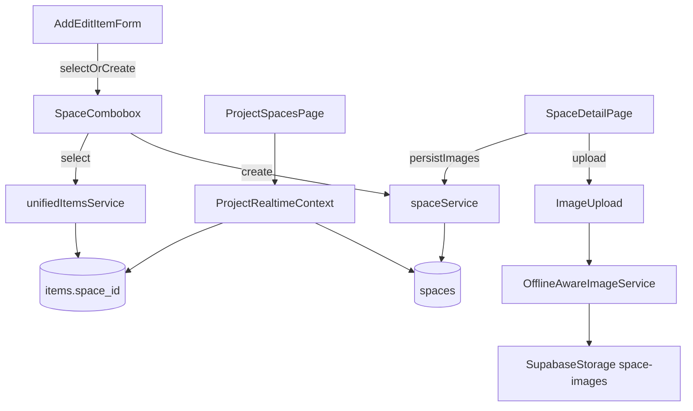

# Implement Spaces entity + UI

## Context (current state)

- **“Location” is currently `Item.space`** (string) stored on `items.space` and validated against **project presets** stored in `projects.settings.locations`.
- The project tab UI is defined in [`src/pages/ProjectLayout.tsx`](/Users/benjaminmackenzie/Dev/ledger/src/pages/ProjectLayout.tsx) and currently only includes Items and Transactions:
```65:68:/Users/benjaminmackenzie/Dev/ledger/src/pages/ProjectLayout.tsx
const sectionDefinitions: Array<{ id: ProjectSection; name: string; icon: typeof Package }> = [
  { id: 'items', name: 'Items', icon: Package },
  { id: 'transactions', name: 'Transactions', icon: FileText },
]
```

- The project route union is currently:
```1:/Users/benjaminmackenzie/Dev/ledger/src/utils/routes.ts
export type ProjectSection = 'items' | 'transactions' | 'budget'
```

- Images are already supported via **JSON arrays** (`items.images`, `transactions.*_images`) and a reusable UI stack (`ImageUpload`, `ImageGallery`) + offline upload queueing (`OfflineAwareImageService`).

## Desired outcome

- Replace the string-only location with a **first-class `Space` object**.
- **Spaces tab** in Project (in addition to Items/Transactions) with:
  - Space list page with **SpacePreviewCard**
  - Space detail page with **primary image + gallery**, notes, and **associated items**
- **Hard migration**: stop using `projects.settings.locations` and `items.space` in the app as part of this feature.
- **Account-wide spaces supported** (optional project association). In a Project, users can pick from:
  - spaces where `project_id = <this project>`
  - spaces where `project_id IS NULL` (account-wide)

## Data model & storage design

### New table: `spaces`

- **Purpose**: store canonical Spaces (name, notes, gallery) scoped to an account, optionally to a project.
- **Columns (recommended)**:
  - `id uuid pk default gen_random_uuid()`
  - `account_id uuid not null references accounts(id) on delete cascade`
  - `project_id uuid null references projects(id) on delete set null` (NULL = account-wide)
  - `name text not null`
  - `notes text null`
  - `images jsonb not null default '[]'::jsonb` (reuse `ItemImage` shape; `isPrimary` determines representative image)
  - `is_archived boolean not null default false`
  - `metadata jsonb not null default '{}'::jsonb` (future-proof: counts, etc.)
  - `created_at timestamptz default now()`, `updated_at timestamptz default now()`
  - `created_by uuid references users(id)`, `updated_by uuid references users(id)`
  - `version int not null default 1` (consistent with offline/conflict patterns)
- **Constraints/indexes**:
  - Unique name per scope: `unique(account_id, project_id, name)`
  - Index `spaces(account_id, project_id)`, `spaces(account_id, is_archived)`

### Item association: replace `items.space` usage

- Add `items.space_id uuid null references spaces(id) on delete set null`.
- Add index `items(space_id)`.

### Storage bucket for space images

- Add Supabase Storage bucket **`space-images`** (manual dashboard step) and RLS policies mirroring existing ones (see [`supabase/migrations/021_add_project_images_storage_policies.sql`](/Users/benjaminmackenzie/Dev/ledger/supabase/migrations/021_add_project_images_storage_policies.sql)).
- Update the upload service to support `space-images` using the same pipeline as items/projects.

## Migration strategy (hard cutover)

### Migration 1: create spaces + item FK

- New migration file:
  - `supabase/migrations/20260124_create_spaces_and_item_space_id.sql`
- Actions:
  - Create `spaces` table + indexes + RLS policies (use `can_access_account` patterns like existing mutable tables).
  - Add `items.space_id` column + FK + index.

### Migration 2: backfill spaces from existing project locations

- New migration file:
  - `supabase/migrations/20260124_backfill_spaces_from_locations.sql`
- Backfill sources:
  - `projects.settings->'locations'` (preferred, as it’s already deduped/validated)
  - plus any distinct non-empty `items.space` values that aren’t in presets (safety)
- Steps (SQL outline):
  - For each project: insert `spaces` rows for each location string; set `project_id`.
  - For each item: set `items.space_id` by matching normalized `items.space` to `spaces.name` within the same project.
  - (Optional) Create **account-wide** spaces for frequently reused names across projects (only if you want automatic reuse). Default plan: **don’t auto-promote**; leave account-wide creation to user UI.

### Migration 3: remove old validation + deprecate presets

- Remove/disable:
  - The `validate_project_item_space()` trigger/function introduced in `supabase/migrations/20260123_add_project_location_presets_and_validation.sql`.
- Leave `projects.settings.locations` and `items.space` columns in DB initially (to avoid breaking older clients), but:
  - app no longer reads/writes them
  - (optional follow-up migration) drop columns after a release window

## Backend/service layer changes

### Types

- Update [`src/types/index.ts`](/Users/benjaminmackenzie/Dev/ledger/src/types/index.ts):
  - Add `export interface Space { ... }`.
  - Add `Item.spaceId?: string | null`.
  - Deprecate `Item.space?: string` (remove usages in code; optionally keep type field temporarily but mark as legacy).

### Data access

- Add `spaceService` in [`src/services/inventoryService.ts`](/Users/benjaminmackenzie/Dev/ledger/src/services/inventoryService.ts) or a new `[src/services/spaceService.ts]` that follows existing patterns:
  - `listSpaces({ accountId, projectId })` returning combined project + account-wide
  - `createSpace`, `updateSpace`, `archiveSpace`, `deleteSpace`
  - `addSpaceImage`, `removeSpaceImage`, `setSpacePrimaryImage`
- Extend realtime snapshot plumbing:
  - Update `ProjectRealtimeContext` (and `useProjectRealtime`) to fetch and cache `spaces` alongside `project/transactions/items` so the Spaces tab and item forms can access them without extra fetch waterfalls.

### Upload pipeline

- Extend [`src/services/imageService.ts`](/Users/benjaminmackenzie/Dev/ledger/src/services/imageService.ts):
  - Add `uploadSpaceImage(file, projectName, spaceId, ...)` targeting bucket `space-images`.
- Extend [`src/services/offlineAwareImageService.ts`](/Users/benjaminmackenzie/Dev/ledger/src/services/offlineAwareImageService.ts) similarly, so space gallery uploads work offline.

## Frontend UI changes

### Routing + tab

- Update [`src/utils/routes.ts`](/Users/benjaminmackenzie/Dev/ledger/src/utils/routes.ts):
  - `ProjectSection` includes `'spaces'`
  - Add helpers: `projectSpaces(projectId)`, `projectSpaceDetail(projectId, spaceId)`, `projectSpaceNew(projectId)`.
- Update [`src/App.tsx`](/Users/benjaminmackenzie/Dev/ledger/src/App.tsx):
  - Add route under `/project/:projectId/*`: `spaces`
  - Add nested route for detail: `spaces/:spaceId` (either nested under ProjectLayout or as standalone page, consistent with Items/Transactions).
- Update [`src/pages/ProjectLayout.tsx`](/Users/benjaminmackenzie/Dev/ledger/src/pages/ProjectLayout.tsx):
  - Add a third section definition for Spaces
  - Update `resolveSectionFromPath` and `sectionPaths`

### Spaces list page

- New page `[src/pages/ProjectSpacesPage.tsx]`:
  - Uses `useProjectLayoutContext()` to access `project`, `items`, and `spaces`.
  - Displays:
    - Search/filter (reuse list patterns from InventoryList/TransactionsList)
    - Grid of `SpacePreviewCard`
    - “Create Space” CTA

### SpacePreviewCard

- New component `[src/components/spaces/SpacePreviewCard.tsx]`:
  - Visual style matches `ItemPreviewCard` (rounded border card, light bg, clear typography).
  - Shows:
    - Primary image (from `space.images.find(i => i.isPrimary)`), fallback placeholder
    - Space name
    - Item count (derived from items where `item.spaceId === space.id`)
    - Small sublabel: “Account-wide” vs “Project”

### Space detail page

- New page `[src/pages/SpaceDetail.tsx]` (or `[src/pages/ProjectSpaceDetail.tsx]`):
  - Header: Space name + edit button
  - Notes section (editable)
  - Gallery:
    - Reuse `ImageUpload` for adding images
    - Reuse `ImageGallery` for viewing
    - Provide “Set as primary” via `isPrimary` toggle (reuse existing “Pin” style pattern where appropriate)
  - Associated items:
    - Reuse existing item list row/card components (`InventoryItemRow` / `ItemPreviewCard`) in a filtered list.

### Update item forms & bulk operations

- Replace location preset combobox usages in:
  - `[src/pages/AddItem.tsx]` / `[src/pages/EditItem.tsx]`
  - `[src/components/ui/BulkItemControls.tsx]`
- New behavior:
  - Combobox lists Spaces (project + account-wide)
  - Allow-create creates a new Space (default project-scoped; optional toggle to create account-wide)
  - On select: set `item.spaceId` (not a string)

### Remove project “Locations” settings UI

- Update [`src/components/ProjectForm.tsx`](/Users/benjaminmackenzie/Dev/ledger/src/components/ProjectForm.tsx):
  - Remove/retire the Locations editor section (since Spaces will be managed in the Spaces tab).

## Data flow diagram



## Rollout & compatibility

- Because this is a **hard cutover**, the UI will stop reading/writing `items.space` and `projects.settings.locations` immediately after deploy.
- Keep the old DB columns for one release window to avoid breaking older clients; then add a follow-up migration to drop:
  - `items.space`
  - `projects.settings.locations`
  - `validate_project_item_space` trigger/function

## Test plan (manual)

- Create Space (project-scoped) from Spaces tab; confirm it appears.
- Create Space (account-wide) and confirm it appears across projects.
- Assign Space to an item in Add/Edit Item and Bulk controls.
- Open Space detail page; confirm associated items list and navigation.
- Upload images to Space; confirm primary selection and gallery viewer.
- Offline mode: add images and ensure placeholders queue + upload when online.
- Confirm legacy Locations section no longer appears in Project settings.